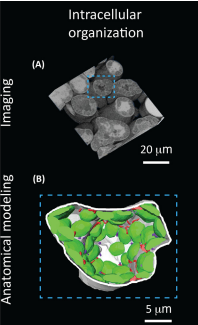

A list of my publications adn citation metrics can be found on my 
<a href="https://scholar.google.com.au/citations?user=ca2u0TMAAAAJ&hl=en"> google scholar </a>  

Here I will expand on that list and briefly summarise my research:

 <a href="https://www.sciencedirect.com/science/article/pii/S1360138518302103"> Embracing 3D Complexity in Leaf Carbon–Water Exchange </a>  
My first ever paper! In this opinion piece I contributed a 3D reconstruction of a wheat mesophyll cell and contributed to the discussion on considering 3D anatomy when trying to better understand mesophyll conductance.  
 
 

 <a href="https://nph.onlinelibrary.wiley.com/doi/full/10.1111/nph.16219"> Cell and chloroplast anatomical features are poorly estimated from 2D cross-sections </a>  
My first ever lead author paper! Here we produced a large amount of cell and chloroplast 3D models and compared the 
 
 

