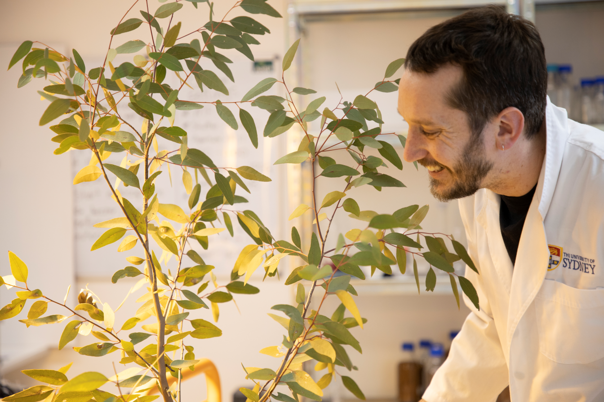
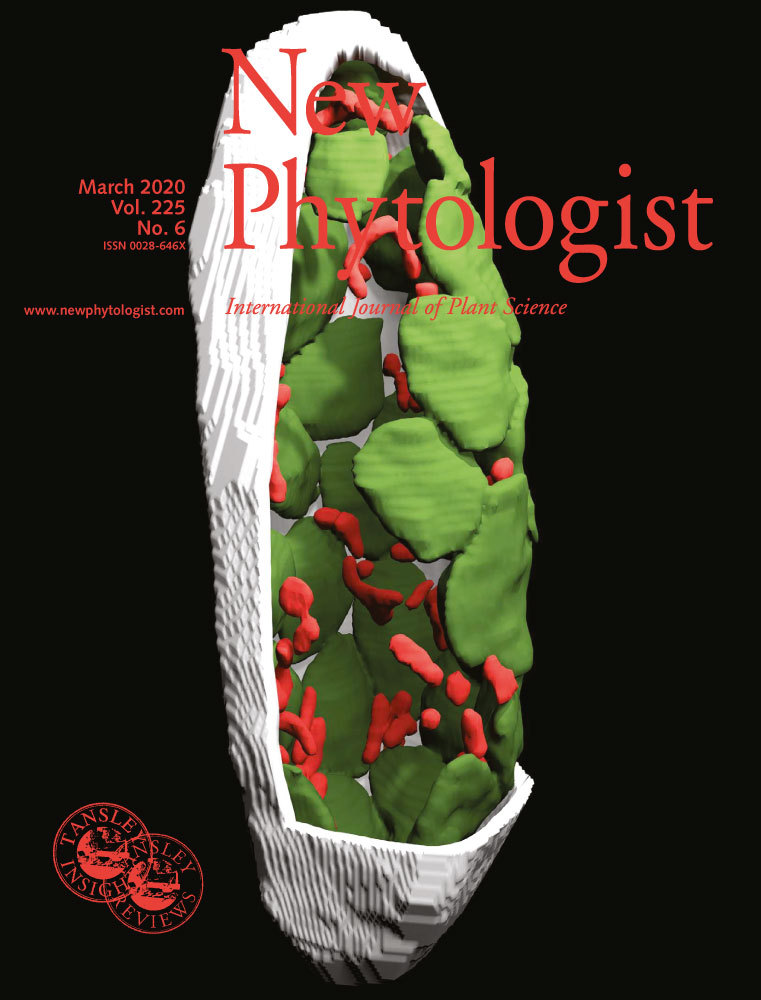

 
 

I am a postdoctoral researcher exploring the plant-soil interface. To better understand biology, I combine experimental and imaging data to explore form-function relationships. My PhD research focused on understanding 3D leaf anatomy and integrating the complex arrangement of leaf tissue with gas exchange and stable isotope datasets. Exploring the links between physiology and anatomy enhances our ability to trace CO2 and water exchange and better understand key leaf processes such as stomatal conductance, mesophyll conductance, hydraulic conductance, and photosynthesis. An improved understanding of these processes further our understanding of the water and carbon cycles and how these cycles will be influenced by climate change.

 
 
  

Here is an example of 3D imaging from my PhD. The image is a 3D reconstruction of a chickpea mesophyll cell (cell wall, white; mitochondria, red; chloroplasts, green) from my PhD paper. 

 

 

Here is an example of 3D imaging from my current postdoc. The image is a 3D reconstruction of a wheat root in soil (root, grey; pore network adjacent to the root, blue). These images were acquired using micro-computed-tomography from my collaboration with the Australia's Nuclear Science and Technology Organization  

 

My research and professional experience have led to following skillsets:  
* Stable isotopes and gas exchange  
* Data Science (Python and R)  
* Bioimage analysis and visualization  
* 3D modelling techniques (e.g. finite element analysis)  
* Building national and international collaboration networks  
* Virtual Reality Development   
* Scientific outreach   
* Teaching  
* Publishing in high impact journals   
* Presenting at international conferences   
 

I can always be reached at richardwilliamharwood@gmail.com and welcome collaborations. 

