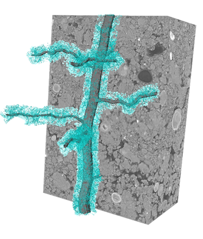

  I am a postdoctral research exploring the plant-soil interface. To better understand biology I combine expirmenal and imaging data to explore form-function relationships. My PhD research focused on understanding 3D leaf anatomy and integrating the complex arrangement of leaf tissue with gas exchange and stable isotope datasets. Exploring the links between physiology and anatomy enhances our ability to trace CO2 and water exchange and better understand key leaf processes such as stomatal conductance, mesophyll conductance, hydraulic conductance and photosynthesis. An improved understanding of these processes further our understanding of the water and carbon cycles and how these cycles will be influenced by climate change. 
 
 

Here is example of  3D imaging from my PhD. The image is 3D reconstruction of a chickpea mesophyll cell (cell wall, white; mitochondria, red; chloroplasts, green) from my PhD paper. 
 
 

Here is example of 3D imaging from my current postdoc. The image is 3D reconstruction of a wheat root in soil (root, grey; ; pore network adjacent to the root, blue) from my PhD paper. These images were acquired using micro-computed-tomography from my collobrartion with the Australia's Nuclear Science and Technology Organisation  
 

